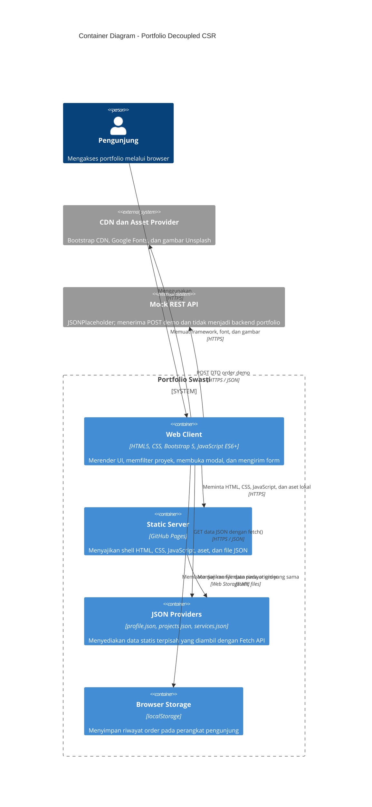

# Portfolio Swasti Sihombing | Week 4

Portfolio akademik Swasti Maristella Sihombing yang direfaktor dari halaman statis menjadi aplikasi decoupled multi-tier dengan dynamic Client-Side Rendering (CSR).

- Repository: https://github.com/SwastiSihombing/ppw-2026-week2-12S24030
- Live deployment: [Portfolio Week 4](https://swastisihombing.github.io/ppw-2026-week2-12S24030/) (saat diperiksa, URL mengembalikan 404 karena GitHub Pages belum diaktifkan)
- Branch pekerjaan: `week4-architecture`

## Arsitektur C4 Container



### Separation of Concerns

- **Presentation Tier:** `index.html`, `css/custom-style.css`, dan `js/app.js` mengatur shell, styling, state antarmuka, rendering, filter, modal, dan interaksi form.
- **Data Access Layer:** `js/api-service.js` bertanggung jawab mengambil tiga provider JSON dan mengirim POST ke mock REST API. Komponen ini memeriksa status HTTP sebelum mengembalikan data.
- **Data Provider:** `data/profile.json`, `data/projects.json`, dan `data/services.json` memisahkan konten dari markup. GitHub Pages hanya menyajikan file statis, bukan menjalankan business logic server.
- **Client-side state:** order disimpan di `localStorage` browser dan jumlahnya diperbarui pada badge. Ini bukan database bersama antarperangkat.
- **REST API:** JSONPlaceholder hanya endpoint demonstrasi POST. Keberhasilan respons mock tidak berarti order tersimpan pada layanan bisnis; jangan masukkan data sensitif.

Pemisahan ini mengurangi ketergantungan konten pada HTML. Perubahan data portfolio dapat dilakukan pada JSON tanpa menulis ulang kartu, sedangkan aturan pengambilan data terpisah dari aturan presentasi.

## Sebelum dan Sesudah Refactoring

| Aspek | Sebelum (versi statis awal) | Sesudah (Week 4) |
| --- | --- | --- |
| Data proyek | Kartu dan tabel ditulis langsung di HTML | `projects.json` diambil dan dirender melalui Fetch API |
| Profil dan layanan | Konten profil di markup; katalog layanan tertanam di form | `profile.json` dan `services.json` menjadi provider terpisah |
| Rendering | Halaman statis, tidak memiliki Data Access Layer | `api-service.js` mengambil data; `app.js` mengelola tampilan |
| Project detail | Tidak ada modal proyek universal | Satu Bootstrap modal diisi berdasarkan ID proyek |
| Form | Demo HTML tanpa asynchronous dispatch | POST JSON ke mock API, Toast, dan fallback localStorage |
| Riwayat | Tidak tersedia | Order lokal ditampilkan pada badge dan daftar riwayat |

### Paradigma Rendering

| Paradigma | Tempat perakitan HTML | Kelebihan | Trade-off |
| --- | --- | --- | --- |
| Monolith SSR | Server aplikasi pada setiap request | HTML awal dapat berisi data | Server menangani rendering dan logika dalam satu aplikasi |
| CSR pada project ini | Browser setelah mengambil JSON | Static hosting, filter dan modal interaktif | Konten utama menunggu JavaScript; API/data harus dapat diakses |
| Jamstack/decoupled | Aset statis saat build/di CDN, data melalui API | Skalabilitas asset statis dan pemisahan layanan | Membutuhkan endpoint API terpisah untuk data dinamis |

## Dynamic CSR dan UI States

- Loading: spinner Bootstrap saat provider sedang diminta.
- Success: profil, skill, kartu/tabel proyek, dan katalog layanan dibuat dari JSON.
- Empty: filter yang tidak memiliki proyek menampilkan pesan kosong.
- Error: kegagalan provider menampilkan alert defensif pada bagian terkait.
- Filter kategori memperbarui kartu secara langsung tanpa reload.
- Proyek memiliki ID, tags, image, link, status, dan metrics pada `data/projects.json`.

Render dinamis menggunakan `createElement()` dan `textContent`; nilai JSON tidak dirangkai ke `innerHTML`. URL gambar dibatasi ke HTTPS atau origin sendiri, dan tautan proyek menolak protokol selain yang diizinkan. CSP dasar dipasang di `index.html`; CSP ini perlu disesuaikan bila sumber eksternal berubah.

## Form dan Persistensi

Form mencegah submit browser standar, mengirim payload JSON menggunakan Fetch POST, menonaktifkan tombol selama request, dan menampilkan Bootstrap Toast. Riwayat order demo disimpan pada key `swasti-portfolio-orders` di localStorage. Jika endpoint tidak dapat dijangkau, aplikasi memberi tahu pengguna dan mencoba menyimpan order lokal.

Endpoint POST menggunakan JSONPlaceholder, layanan mock publik untuk demonstrasi. Tidak ada backend portfolio atau penyimpanan order server-side.

## Menjalankan Project

Gunakan Live Server atau static HTTP server dari root repository. Jangan membuka `index.html` langsung dengan skema `file://`, karena Fetch API memerlukan origin HTTP untuk membaca JSON.

```powershell
python -m http.server 8000
```

Buka `http://localhost:8000/`. Project memerlukan koneksi internet untuk Bootstrap CDN, Google Fonts, gambar remote, dan mock API.

## Network Profiling

> **Belum diukur:** angka berikut harus diisi dari pengujian Chrome DevTools pada project yang sudah dijalankan. Jangan mengganti placeholder dengan perkiraan. Catat 304 hanya jika status itu benar-benar muncul.

| Skenario | TTFB dokumen | FCP | Total load | Cache-Control | ETag / 304 | Waterfall |
| --- | --- | --- | --- | --- | --- | --- |
| Cold load (Disable cache aktif) | Belum diukur | Belum diukur | Belum diukur | Belum dicatat | Belum dicatat | Belum dilampirkan |
| Warm load (cache aktif, reload) | Belum diukur | Belum diukur | Belum diukur | Belum dicatat | Belum dicatat | Belum dilampirkan |

Screenshot Network Waterfall: **belum dilampirkan**. Simpan screenshot hasil DevTools di `screenshots/network-waterfall.png`, lalu tautkan di sini setelah pengujian.

Panduan pencatatan: buka DevTools → Network, aktifkan **Disable cache** untuk cold load, reload dan catat baris dokumen/JSON serta timing; nonaktifkan **Disable cache** untuk warm load dan reload kembali. Catat FCP dari Performance atau metrik browser yang tersedia. Header cache dan 304 bergantung pada respons server/CDN; GitHub Pages atau mock endpoint mungkin tidak mengirim 304 pada setiap konfigurasi.

## Git dan Deployment

Perubahan Week 4 sudah di-commit dan di-push pada branch `week4-architecture`. Pages API saat pemeriksaan mengembalikan 404 dan URL live belum aktif. Pemilik repository perlu membuka Settings → Pages, memilih **Deploy from a branch**, branch `week4-architecture`, folder `/(root)`, lalu Save. Setelah deployment selesai, buka URL live di atas dan pastikan keempat JSON berhasil dimuat.

## Struktur Project

```text
.
├── assets/
│   └── profile.jpeg
├── css/
│   └── custom-style.css
├── data/
│   ├── profile.json
│   ├── projects.json
│   └── services.json
├── js/
│   ├── api-service.js
│   └── app.js
├── index.html
└── README.md
```
